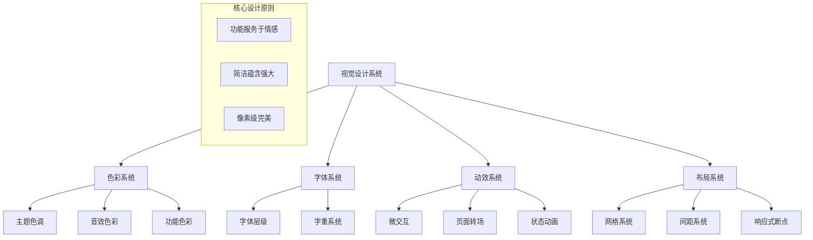

# Design Document

## Overview

白噪音网站UI增强项目旨在将现有的功能性界面提升为具有高端冥想应用品质的沉浸式体验。设计将采用深邃的色彩基调、有机的动画效果、精致的毛玻璃质感，以及情感化的交互细节，创造一个既功能完善又视觉震撼的数字禅境。

## Architecture

### 设计系统架构



## Components and Interfaces

### 1. 色彩设计系统

#### 主色调方案
```css
:root {
    /* 深邃基调 - 冥想应用风格 */
    --primary-deep: #1a1d29;
    --primary-medium: #252936;
    --primary-light: #2f3349;
    
    /* 沉浸式渐变背景 */
    --bg-gradient-primary: linear-gradient(135deg, 
        #1a1d29 0%, 
        #252936 25%, 
        #2f3349 50%, 
        #1e2a3a 75%, 
        #1a1d29 100%);
    
    /* 音效主题色彩 */
    --rain-theme: linear-gradient(135deg, #4a6fa5 0%, #2c5282 100%);
    --waves-theme: linear-gradient(135deg, #2d7dd2 0%, #1a5490 100%);
    --fire-theme: linear-gradient(135deg, #d69e2e 0%, #b7791f 100%);
    --forest-theme: linear-gradient(135deg, #38a169 0%, #2f855a 100%);
    --cafe-theme: linear-gradient(135deg, #c05621 0%, #9c4221 100%);
    
    /* 毛玻璃效果 */
    --glass-light: rgba(255, 255, 255, 0.1);
    --glass-medium: rgba(255, 255, 255, 0.15);
    --glass-heavy: rgba(255, 255, 255, 0.2);
    
    /* 发光效果 */
    --glow-soft: 0 0 20px rgba(255, 255, 255, 0.1);
    --glow-medium: 0 0 30px rgba(255, 255, 255, 0.15);
    --glow-strong: 0 0 40px rgba(255, 255, 255, 0.2);
    
    /* 阴影层次 */
    --shadow-float: 0 8px 32px rgba(0, 0, 0, 0.3);
    --shadow-elevated: 0 16px 48px rgba(0, 0, 0, 0.4);
    --shadow-deep: 0 24px 64px rgba(0, 0, 0, 0.5);
}
```

#### 动态色彩系统
- **背景色彩流动**: 使用CSS动画创建缓慢的色彩渐变流动
- **音效主题切换**: 根据选择的音效动态调整整体色调
- **时间感知色彩**: 根据用户本地时间微调色温

### 2. 字体设计系统

#### 字体层级
```css
:root {
    /* 字体家族 */
    --font-primary: -apple-system, BlinkMacSystemFont, 'SF Pro Display', 
                    'Segoe UI', Roboto, 'Helvetica Neue', Arial, sans-serif;
    --font-mono: 'SF Mono', Monaco, 'Cascadia Code', 'Roboto Mono', 
                 'Courier New', monospace;
    
    /* 字体大小 */
    --text-xs: 0.75rem;    /* 12px */
    --text-sm: 0.875rem;   /* 14px */
    --text-base: 1rem;     /* 16px */
    --text-lg: 1.125rem;   /* 18px */
    --text-xl: 1.25rem;    /* 20px */
    --text-2xl: 1.5rem;    /* 24px */
    --text-3xl: 1.875rem;  /* 30px */
    --text-4xl: 2.25rem;   /* 36px */
    
    /* 字重系统 */
    --font-thin: 100;
    --font-light: 300;
    --font-normal: 400;
    --font-medium: 500;
    --font-semibold: 600;
    --font-bold: 700;
    
    /* 行高系统 */
    --leading-tight: 1.25;
    --leading-normal: 1.5;
    --leading-relaxed: 1.75;
}
```

### 3. 动效设计系统

#### 缓动函数
```css
:root {
    /* 自然缓动 */
    --ease-natural: cubic-bezier(0.25, 0.46, 0.45, 0.94);
    --ease-gentle: cubic-bezier(0.25, 0.1, 0.25, 1);
    --ease-smooth: cubic-bezier(0.4, 0, 0.2, 1);
    
    /* 弹性缓动 */
    --ease-bounce: cubic-bezier(0.68, -0.55, 0.265, 1.55);
    --ease-back: cubic-bezier(0.175, 0.885, 0.32, 1.275);
    
    /* 时间系统 */
    --duration-instant: 0.1s;
    --duration-fast: 0.2s;
    --duration-normal: 0.3s;
    --duration-slow: 0.5s;
    --duration-slower: 0.8s;
}
```

#### 核心动画效果

##### 1. 浮现动画
```css
@keyframes materialise {
    0% {
        opacity: 0;
        transform: translateY(20px) scale(0.95);
        filter: blur(10px);
    }
    100% {
        opacity: 1;
        transform: translateY(0) scale(1);
        filter: blur(0);
    }
}
```

##### 2. 呼吸动画
```css
@keyframes breathe {
    0%, 100% {
        transform: scale(1);
        box-shadow: var(--glow-soft);
    }
    50% {
        transform: scale(1.02);
        box-shadow: var(--glow-medium);
    }
}
```

##### 3. 涟漪效果
```css
@keyframes ripple {
    0% {
        transform: scale(0);
        opacity: 1;
    }
    100% {
        transform: scale(4);
        opacity: 0;
    }
}
```

##### 4. 背景流动
```css
@keyframes backgroundFlow {
    0% { background-position: 0% 50%; }
    25% { background-position: 100% 25%; }
    50% { background-position: 50% 100%; }
    75% { background-position: 25% 0%; }
    100% { background-position: 0% 50%; }
}
```

### 4. 组件设计规范

#### 主播放按钮设计
```css
.play-button-enhanced {
    /* 基础样式 */
    width: 120px;
    height: 120px;
    border-radius: 50%;
    border: none;
    
    /* 毛玻璃效果 */
    background: var(--glass-medium);
    backdrop-filter: blur(20px);
    -webkit-backdrop-filter: blur(20px);
    
    /* 边框光晕 */
    border: 1px solid rgba(255, 255, 255, 0.2);
    
    /* 阴影层次 */
    box-shadow: 
        var(--shadow-float),
        inset 0 1px 0 rgba(255, 255, 255, 0.1),
        inset 0 -1px 0 rgba(0, 0, 0, 0.1);
    
    /* 过渡效果 */
    transition: all var(--duration-normal) var(--ease-natural);
    
    /* 内容居中 */
    display: flex;
    align-items: center;
    justify-content: center;
    
    /* 字体样式 */
    font-family: var(--font-primary);
    font-weight: var(--font-medium);
    font-size: var(--text-lg);
    color: rgba(255, 255, 255, 0.9);
}

.play-button-enhanced:hover {
    transform: scale(1.05);
    box-shadow: 
        var(--shadow-elevated),
        var(--glow-medium),
        inset 0 1px 0 rgba(255, 255, 255, 0.15);
    background: var(--glass-heavy);
}

.play-button-enhanced:active {
    transform: scale(0.98);
    transition-duration: var(--duration-fast);
}

.play-button-enhanced.playing {
    animation: breathe 3s var(--ease-natural) infinite;
}
```

#### 音效选择器设计
```css
.sound-button-enhanced {
    /* 基础布局 */
    display: flex;
    flex-direction: column;
    align-items: center;
    padding: 1.5rem 1rem;
    
    /* 毛玻璃卡片 */
    background: var(--glass-light);
    backdrop-filter: blur(15px);
    -webkit-backdrop-filter: blur(15px);
    border: 1px solid rgba(255, 255, 255, 0.1);
    border-radius: 16px;
    
    /* 浮动效果 */
    box-shadow: var(--shadow-float);
    
    /* 过渡 */
    transition: all var(--duration-normal) var(--ease-natural);
    cursor: pointer;
    
    /* 防止选中 */
    user-select: none;
    -webkit-user-select: none;
}

.sound-button-enhanced:hover {
    transform: translateY(-4px) scale(1.02);
    box-shadow: var(--shadow-elevated);
    background: var(--glass-medium);
    border-color: rgba(255, 255, 255, 0.2);
}

.sound-button-enhanced.active {
    background: var(--glass-heavy);
    border-color: rgba(255, 255, 255, 0.3);
    box-shadow: 
        var(--shadow-elevated),
        var(--glow-strong);
    animation: breathe 4s var(--ease-natural) infinite;
}

.sound-icon-enhanced {
    font-size: 2.5rem;
    margin-bottom: 0.75rem;
    filter: drop-shadow(0 2px 4px rgba(0, 0, 0, 0.3));
    transition: all var(--duration-normal) var(--ease-natural);
}

.sound-button-enhanced:hover .sound-icon-enhanced {
    transform: scale(1.1);
    filter: drop-shadow(0 4px 8px rgba(0, 0, 0, 0.4));
}

.sound-name-enhanced {
    font-family: var(--font-primary);
    font-weight: var(--font-medium);
    font-size: var(--text-sm);
    color: rgba(255, 255, 255, 0.9);
    text-align: center;
    letter-spacing: 0.025em;
}
```

#### 设置面板设计
```css
.settings-panel-enhanced {
    /* 全屏覆盖 */
    position: fixed;
    top: 0;
    left: 0;
    width: 100%;
    height: 100%;
    z-index: 1000;
    
    /* 背景虚化 */
    background: rgba(0, 0, 0, 0.6);
    backdrop-filter: blur(10px);
    -webkit-backdrop-filter: blur(10px);
    
    /* 居中布局 */
    display: flex;
    align-items: center;
    justify-content: center;
    
    /* 初始隐藏 */
    opacity: 0;
    visibility: hidden;
    transition: all var(--duration-normal) var(--ease-natural);
}

.settings-panel-enhanced.visible {
    opacity: 1;
    visibility: visible;
}

.settings-content-enhanced {
    /* 尺寸和定位 */
    width: 90%;
    max-width: 400px;
    max-height: 80vh;
    
    /* 毛玻璃效果 */
    background: var(--glass-heavy);
    backdrop-filter: blur(30px);
    -webkit-backdrop-filter: blur(30px);
    
    /* 边框和圆角 */
    border: 1px solid rgba(255, 255, 255, 0.2);
    border-radius: 24px;
    
    /* 阴影 */
    box-shadow: var(--shadow-deep);
    
    /* 内边距 */
    padding: 2rem;
    
    /* 动画 */
    transform: translateY(20px) scale(0.95);
    transition: all var(--duration-normal) var(--ease-back);
}

.settings-panel-enhanced.visible .settings-content-enhanced {
    transform: translateY(0) scale(1);
}
```

## Data Models

### 主题配置模型
```javascript
const themeConfig = {
    backgrounds: {
        rain: {
            gradient: 'linear-gradient(135deg, #4a6fa5 0%, #2c5282 50%, #1a365d 100%)',
            particles: 'rain-drops',
            ambientColor: '#4a6fa5'
        },
        waves: {
            gradient: 'linear-gradient(135deg, #2d7dd2 0%, #1a5490 50%, #0f3460 100%)',
            particles: 'wave-ripples',
            ambientColor: '#2d7dd2'
        },
        fire: {
            gradient: 'linear-gradient(135deg, #d69e2e 0%, #b7791f 50%, #8b5a0f 100%)',
            particles: 'fire-sparks',
            ambientColor: '#d69e2e'
        },
        forest: {
            gradient: 'linear-gradient(135deg, #38a169 0%, #2f855a 50%, #1a4a3a 100%)',
            particles: 'leaf-fall',
            ambientColor: '#38a169'
        },
        cafe: {
            gradient: 'linear-gradient(135deg, #c05621 0%, #9c4221 50%, #7a2e0e 100%)',
            particles: 'steam-rise',
            ambientColor: '#c05621'
        }
    },
    
    animations: {
        duration: {
            instant: 100,
            fast: 200,
            normal: 300,
            slow: 500,
            slower: 800
        },
        easing: {
            natural: 'cubic-bezier(0.25, 0.46, 0.45, 0.94)',
            gentle: 'cubic-bezier(0.25, 0.1, 0.25, 1)',
            smooth: 'cubic-bezier(0.4, 0, 0.2, 1)',
            bounce: 'cubic-bezier(0.68, -0.55, 0.265, 1.55)'
        }
    }
};
```

### 交互状态模型
```javascript
const interactionStates = {
    idle: {
        scale: 1,
        opacity: 1,
        blur: 0,
        glow: 0
    },
    hover: {
        scale: 1.05,
        opacity: 1,
        blur: 0,
        glow: 0.15
    },
    active: {
        scale: 0.98,
        opacity: 1,
        blur: 0,
        glow: 0.2
    },
    playing: {
        scale: 1,
        opacity: 1,
        blur: 0,
        glow: 0.1,
        animation: 'breathe'
    }
};
```

## Error Handling

### 视觉反馈错误处理
1. **动画降级**: 当设备性能不足时，自动禁用复杂动画
2. **毛玻璃降级**: 不支持backdrop-filter的浏览器使用半透明背景
3. **色彩适配**: 自动检测用户的色彩偏好和可访问性需求

### 性能优化错误处理
1. **GPU加速检测**: 自动检测并启用硬件加速
2. **内存监控**: 监控动画内存使用，必要时降级效果
3. **帧率监控**: 实时监控动画帧率，自动调整复杂度

## Testing Strategy

### 视觉回归测试
1. **截图对比**: 自动化截图对比测试，确保视觉一致性
2. **动画测试**: 验证关键动画的流畅性和正确性
3. **响应式测试**: 测试不同屏幕尺寸下的布局和效果

### 性能测试
1. **渲染性能**: 测量首屏渲染时间和动画帧率
2. **内存使用**: 监控长时间使用的内存泄漏
3. **电池影响**: 测试动画对移动设备电池的影响

### 可访问性测试
1. **对比度测试**: 确保所有文本符合WCAG标准
2. **动画偏好**: 尊重用户的减少动画偏好设置
3. **键盘导航**: 测试所有交互的键盘可访问性

## Implementation Architecture

### CSS架构
```
styles/
├── base/
│   ├── reset.css          # 样式重置
│   ├── variables.css      # CSS变量定义
│   └── typography.css     # 字体系统
├── components/
│   ├── buttons.css        # 按钮组件
│   ├── panels.css         # 面板组件
│   └── controls.css       # 控制组件
├── animations/
│   ├── keyframes.css      # 关键帧动画
│   ├── transitions.css    # 过渡效果
│   └── interactions.css   # 交互动画
├── themes/
│   ├── sound-themes.css   # 音效主题
│   └── time-themes.css    # 时间主题
└── responsive/
    ├── mobile.css         # 移动端适配
    ├── tablet.css         # 平板适配
    └── desktop.css        # 桌面端适配
```

### JavaScript增强
```javascript
// 主题管理器
class ThemeManager {
    constructor() {
        this.currentTheme = 'default';
        this.transitionDuration = 300;
    }
    
    switchTheme(soundType) {
        // 平滑切换主题色彩
    }
    
    adaptToTime() {
        // 根据时间调整色温
    }
}

// 动画管理器
class AnimationManager {
    constructor() {
        this.activeAnimations = new Map();
        this.performanceMode = 'auto';
    }
    
    playAnimation(element, animationType, options) {
        // 播放优化的动画
    }
    
    optimizePerformance() {
        // 根据设备性能调整动画复杂度
    }
}

// 交互增强器
class InteractionEnhancer {
    constructor() {
        this.rippleEffects = new Map();
        this.hoverStates = new Map();
    }
    
    addRippleEffect(element, event) {
        // 添加涟漪效果
    }
    
    enhanceHover(element) {
        // 增强悬停效果
    }
}
```

## Performance Considerations

### 渲染优化
1. **GPU加速**: 使用transform和opacity进行动画
2. **图层管理**: 合理使用will-change属性
3. **重绘最小化**: 避免触发layout和paint的属性变化

### 内存优化
1. **动画清理**: 及时清理完成的动画
2. **事件解绑**: 组件销毁时清理事件监听器
3. **资源复用**: 复用动画和效果实例

### 电池优化
1. **帧率控制**: 根据设备能力调整动画帧率
2. **暂停机制**: 页面不可见时暂停动画
3. **降级策略**: 低电量时自动降级视觉效果

## Accessibility Enhancements

### 视觉可访问性
1. **高对比度模式**: 支持系统高对比度设置
2. **色彩无关**: 不依赖颜色传达重要信息
3. **文字缩放**: 支持200%文字缩放

### 动画可访问性
1. **减少动画**: 尊重prefers-reduced-motion设置
2. **动画控制**: 提供动画开关选项
3. **焦点管理**: 动画不干扰焦点状态

### 交互可访问性
1. **键盘导航**: 所有功能支持键盘操作
2. **屏幕阅读器**: 提供丰富的ARIA标签
3. **触摸优化**: 足够大的触摸目标区域