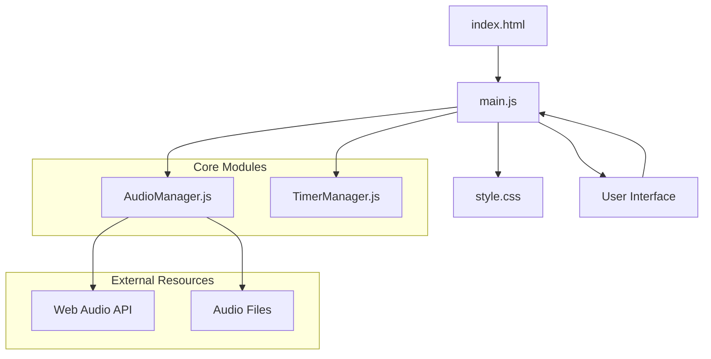

# Design Document

## Overview

白噪音网站是一个基于Web Audio API的单页面应用程序，提供沉浸式的环境音效播放体验。系统采用模块化架构，将音频管理、定时器控制和用户界面分离，确保代码的可维护性和扩展性。

## Architecture

### 系统架构图



### 技术栈

- **前端框架**: 原生JavaScript (ES6+)
- **音频处理**: Web Audio API
- **样式**: CSS3 (Flexbox, CSS Grid, CSS Animations)
- **构建工具**: 无需构建工具，直接运行在浏览器中

## Components and Interfaces

### 1. AudioManager 类

**职责**: 管理所有音频相关操作，包括加载、播放、停止和音量控制

**接口设计**:
```javascript
class AudioManager {
    constructor()
    async loadSounds(soundList)
    playSound(name)
    stopSound(name)
    setVolume(name, volume)
    stopAllSounds()
    getCurrentlyPlaying()
}
```

**核心属性**:
- `audioContext`: AudioContext实例
- `soundBuffers`: 存储解码后的音频数据
- `activeSources`: 跟踪当前播放的音源
- `gainNodes`: 存储每个音源的音量控制节点

### 2. TimerManager 类

**职责**: 管理定时器功能，支持设置和取消定时任务

**接口设计**:
```javascript
class TimerManager {
    constructor()
    start(minutes, callback)
    cancel()
    getRemainingTime()
    isActive()
}
```

**核心属性**:
- `activeTimer`: 当前活动的定时器ID
- `startTime`: 定时器开始时间
- `duration`: 定时器持续时间

### 3. UI Controller (main.js)

**职责**: 协调用户界面和核心模块之间的交互

**核心功能**:
- 初始化所有模块
- 绑定DOM事件监听器
- 管理UI状态更新
- 处理用户交互逻辑

## Data Models

### 音频配置模型

```javascript
const soundConfig = {
    rain: {
        path: 'audio/rain.mp3',
        name: '雨声',
        icon: '🌧️'
    },
    waves: {
        path: 'audio/waves.mp3',
        name: '海浪声',
        icon: '🌊'
    },
    fire: {
        path: 'audio/fire.mp3',
        name: '篝火声',
        icon: '🔥'
    },
    forest: {
        path: 'audio/forest.mp3',
        name: '森林声',
        icon: '🌲'
    },
    cafe: {
        path: 'audio/cafe.mp3',
        name: '咖啡厅',
        icon: '☕'
    }
};
```

### 应用状态模型

```javascript
const appState = {
    isPlaying: false,
    currentSound: null,
    volume: 0.7,
    timerActive: false,
    timerDuration: 0
};
```

## Error Handling

### 音频加载错误处理

1. **网络错误**: 当音频文件无法加载时，显示友好的错误提示
2. **格式不支持**: 检测浏览器音频格式支持，提供降级方案
3. **AudioContext错误**: 处理浏览器音频上下文创建失败的情况

### 用户交互错误处理

1. **重复点击保护**: 防止用户快速点击导致的状态混乱
2. **定时器冲突**: 确保同时只能有一个定时器活动
3. **音量范围验证**: 确保音量值在有效范围内

### 错误处理策略

```javascript
// 错误处理示例
try {
    await audioManager.loadSounds(soundConfig);
} catch (error) {
    console.error('音频加载失败:', error);
    showErrorMessage('音频文件加载失败，请检查网络连接');
}
```

## Testing Strategy

### 单元测试

1. **AudioManager测试**:
   - 音频加载功能测试
   - 播放/停止功能测试
   - 音量控制测试
   - 错误处理测试

2. **TimerManager测试**:
   - 定时器设置测试
   - 定时器取消测试
   - 回调函数执行测试

### 集成测试

1. **用户交互流程测试**:
   - 播放按钮点击流程
   - 音效切换流程
   - 定时器设置流程
   - 音量调节流程

### 浏览器兼容性测试

1. **现代浏览器支持**:
   - Chrome 66+
   - Firefox 60+
   - Safari 11.1+
   - Edge 79+

2. **Web Audio API功能测试**:
   - AudioContext创建
   - 音频解码功能
   - 音频播放功能

### 性能测试

1. **音频加载性能**:
   - 首次加载时间测试
   - 内存使用情况监控
   - 多音频同时播放性能

2. **UI响应性测试**:
   - 按钮点击响应时间
   - 音量滑块实时响应
   - 动画流畅度测试

## UI/UX Design Specifications

### 现代化设计原则

1. **现代扁平化设计**: 参考Material Design和iOS设计语言，使用卡片式布局和微妙阴影
2. **沉浸式体验**: 全屏渐变背景或动态粒子效果，营造专注环境
3. **移动优先**: 优先考虑移动设备体验，然后适配桌面端
4. **可访问性**: 支持深色模式、高对比度和键盘导航
5. **微交互**: 丰富的动画反馈和状态指示

### 现代化色彩方案

```css
:root {
    /* 主色调 - 现代渐变色 */
    --primary-gradient: linear-gradient(135deg, #667eea 0%, #764ba2 100%);
    --secondary-gradient: linear-gradient(135deg, #f093fb 0%, #f5576c 100%);
    --accent-gradient: linear-gradient(135deg, #4facfe 0%, #00f2fe 100%);
    
    /* 音效主题色 */
    --rain-color: linear-gradient(135deg, #74b9ff 0%, #0984e3 100%);
    --waves-color: linear-gradient(135deg, #00cec9 0%, #00b894 100%);
    --fire-color: linear-gradient(135deg, #fd79a8 0%, #e84393 100%);
    --forest-color: linear-gradient(135deg, #00b894 0%, #00a085 100%);
    --cafe-color: linear-gradient(135deg, #fdcb6e 0%, #e17055 100%);
    
    /* 基础色彩 */
    --text-primary: #2d3436;
    --text-secondary: #636e72;
    --text-light: #b2bec3;
    --background-light: #ffffff;
    --background-dark: #2d3436;
    --surface-light: rgba(255, 255, 255, 0.9);
    --surface-dark: rgba(45, 52, 54, 0.9);
    
    /* 功能色彩 */
    --success-color: #00b894;
    --warning-color: #fdcb6e;
    --error-color: #e17055;
    --info-color: #74b9ff;
    
    /* 阴影和效果 */
    --shadow-light: 0 4px 20px rgba(0, 0, 0, 0.1);
    --shadow-medium: 0 8px 30px rgba(0, 0, 0, 0.15);
    --shadow-heavy: 0 15px 50px rgba(0, 0, 0, 0.2);
    --blur-effect: blur(20px);
    
    /* 动画参数 */
    --transition-fast: 0.2s cubic-bezier(0.4, 0, 0.2, 1);
    --transition-normal: 0.3s cubic-bezier(0.4, 0, 0.2, 1);
    --transition-slow: 0.5s cubic-bezier(0.4, 0, 0.2, 1);
}

/* 深色模式 */
@media (prefers-color-scheme: dark) {
    :root {
        --text-primary: #ddd;
        --text-secondary: #b2bec3;
        --background-light: #2d3436;
        --surface-light: rgba(45, 52, 54, 0.9);
    }
}
```

### 现代化布局规范

#### 1. 主播放按钮设计
- **尺寸**: 移动端100px，桌面端120px的圆形按钮
- **图标**: 使用SVG播放/暂停图标，而非文字
- **效果**: 毛玻璃背景、动态阴影、按压动画
- **状态**: 播放时显示音频波形动画

#### 2. 音效选择器现代化设计
- **布局**: 响应式网格，移动端3列，桌面端5列
- **按钮**: 大尺寸圆形按钮（80px-100px）
- **图标**: 高质量SVG图标或emoji，配合渐变背景
- **状态**: 激活时显示呼吸动画效果
- **预览**: 长按显示音效波形预览

#### 3. 控制面板现代化
- **音量控制**: 现代化滑块设计，实时音量可视化
- **定时器**: 圆形进度条设计，优雅的时间选择器
- **设置面板**: 全屏模态框，毛玻璃背景

### 高级动画效果

#### 1. 页面加载动画
```css
@keyframes pageLoad {
    0% { opacity: 0; transform: translateY(30px); }
    100% { opacity: 1; transform: translateY(0); }
}
```

#### 2. 音效按钮呼吸动画
```css
@keyframes breathe {
    0%, 100% { transform: scale(1); }
    50% { transform: scale(1.05); }
}
```

#### 3. 播放按钮波形动画
```css
@keyframes waveform {
    0%, 100% { height: 20px; }
    50% { height: 40px; }
}
```

#### 4. 背景粒子动画
```css
@keyframes float {
    0%, 100% { transform: translateY(0px) rotate(0deg); }
    33% { transform: translateY(-30px) rotate(120deg); }
    66% { transform: translateY(30px) rotate(240deg); }
}
```

### 响应式设计规范

#### 移动端优化 (320px - 768px)
- **触摸友好**: 最小点击区域44px
- **手势支持**: 滑动切换音效，双击播放
- **全屏体验**: 隐藏浏览器UI，沉浸式体验
- **性能优化**: 减少动画复杂度，优化渲染

#### 平板端适配 (768px - 1024px)
- **混合布局**: 结合移动端和桌面端特性
- **横屏优化**: 水平布局音效选择器
- **触摸+鼠标**: 同时支持触摸和鼠标操作

#### 桌面端增强 (1024px+)
- **键盘快捷键**: 完整的键盘操作支持
- **鼠标悬停**: 丰富的悬停效果和提示
- **多窗口**: 支持窗口缩放和多显示器

### 可访问性设计

#### 1. 视觉可访问性
- **对比度**: 符合WCAG 2.1 AA标准
- **字体大小**: 支持用户自定义缩放
- **色彩**: 不依赖颜色传达信息

#### 2. 操作可访问性
- **键盘导航**: 完整的Tab键导航
- **屏幕阅读器**: 语义化HTML和ARIA标签
- **焦点指示**: 清晰的焦点状态

#### 3. 认知可访问性
- **简洁界面**: 减少认知负担
- **一致性**: 统一的交互模式
- **反馈**: 及时的操作反馈

### 性能优化设计

#### 1. 渲染优化
- **CSS动画**: 优先使用transform和opacity
- **GPU加速**: 使用will-change属性
- **重绘最小化**: 避免频繁的布局变化

#### 2. 资源优化
- **图标**: 使用SVG sprite或icon font
- **图片**: WebP格式，响应式图片
- **字体**: 字体子集化，预加载关键字体

#### 3. 交互优化
- **防抖节流**: 优化高频事件处理
- **懒加载**: 非关键资源延迟加载
- **预加载**: 预测用户行为，提前加载

## File Structure

```
white-noise-website/
├── index.html              # 主HTML文件
├── css/
│   └── style.css          # 主样式文件
├── js/
│   ├── AudioManager.js    # 音频管理模块
│   ├── TimerManager.js    # 定时器管理模块
│   └── main.js           # 主控制逻辑
└── audio/                # 音频文件目录
    ├── rain.mp3
    ├── waves.mp3
    ├── fire.mp3
    ├── forest.mp3
    └── cafe.mp3
```

## Security Considerations

1. **内容安全策略**: 实施CSP防止XSS攻击
2. **音频文件验证**: 确保音频文件来源可信
3. **用户输入验证**: 验证定时器输入值的合法性

## Performance Optimization

1. **音频预加载**: 页面加载时预加载所有音频文件
2. **内存管理**: 及时清理不使用的AudioBufferSourceNode
3. **懒加载**: 考虑对大音频文件实施懒加载策略
4. **缓存策略**: 利用浏览器缓存减少重复加载