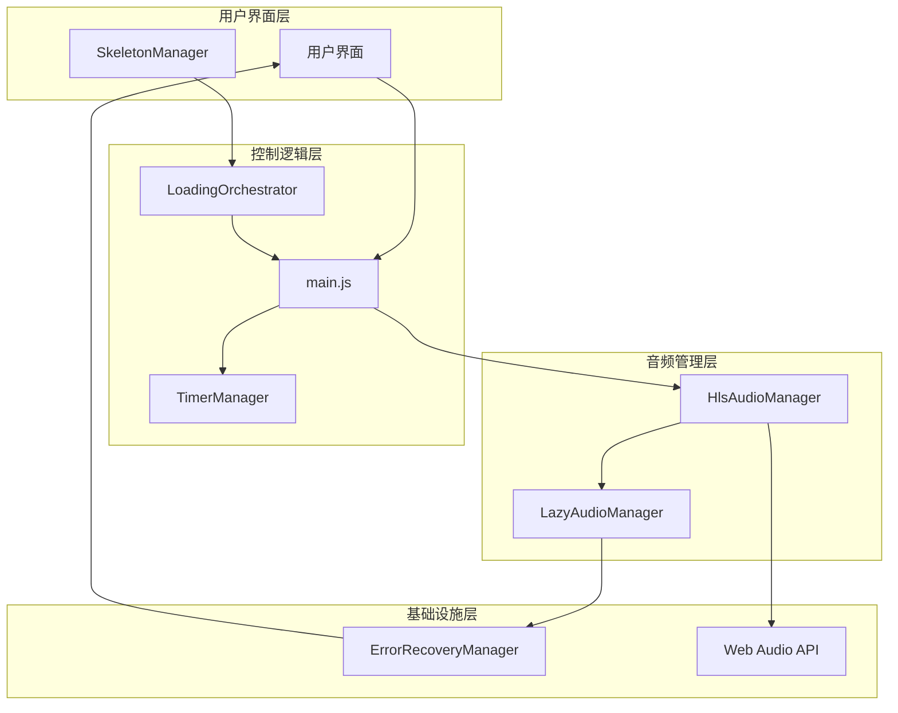

# 静谧之夜 🌧️

一个基于HLS流媒体技术的现代化白噪音网站，提供多种环境音效的高质量播放体验，帮助用户放松身心、提高专注力或改善睡眠质量。

## ✨ 核心特性

### 🎵 多音效支持
- **8种环境音效**: 雨声、海浪声、篝火声、森林声、咖啡厅、白噪音、风声等
- **HLS流媒体**: 采用HLS(HTTP Live Streaming)技术，支持高质量音频流
- **多音效叠加**: 支持同时播放多种音效，创造个性化环境音
- **无缝循环**: 音效平滑循环播放，无间断体验

### 🎛️ 高级音频控制
- **实时音量调节**: 基于Web Audio API的精细音量控制
- **音量可视化**: 动态音量条显示当前播放状态
- **平滑淡入淡出**: 避免突然的音频切换造成的不适
- **智能音频管理**: 支持懒加载和按需加载优化性能

### ⏰ 智能定时功能
- **预设定时器**: 15分、30分、60分快速设置
- **自定义时长**: 支持1-480分钟自定义定时
- **圆形进度条**: 直观显示剩余时间和进度
- **自动停止**: 定时结束后自动停止播放并重置状态

### 🏗️ 现代化架构
- **模块化设计**: 采用ES6+模块化架构，便于维护和扩展
- **错误恢复机制**: 智能的错误处理和自动恢复系统
- **加载编排器**: 分阶段加载策略，优化启动性能
- **骨架屏系统**: 提升页面加载感知性能

### 📱 用户体验优化
- **响应式设计**: 完美适配桌面端和移动端
- **键盘快捷键**: 支持空格键播放/暂停，数字键快速选择音效
- **设置持久化**: 自动保存用户偏好设置
- **无障碍支持**: 遵循ARIA标准，支持屏幕阅读器

## 🚀 快速开始

### 环境要求

- **现代浏览器**: Chrome 66+, Firefox 60+, Safari 11.1+, Edge 79+
- **本地服务器**: 由于浏览器安全策略，需要通过HTTP(S)协议访问
- **音频资源**: HLS格式的音频文件（已包含sample配置）

### 1. 获取项目

```bash
git clone <repository-url>
cd 静谧之夜
```

### 2. 启动本地服务器

```bash
# 使用Python (推荐)
python -m http.server 8000

# 或使用Node.js
npx http-server

# 或使用PHP
php -S localhost:8000
```

### 3. 访问应用

打开浏览器访问 `http://localhost:8000`

## 🎮 使用指南

### 基本操作

1. **播放控制**
   - 点击中央播放按钮开始/暂停播放
   - 首次播放会自动选择雨声作为默认音效

2. **音效选择**
   - 点击底部音效图标选择或切换音效
   - 支持多个音效同时播放（叠加模式）
   - 再次点击已选中的音效可以关闭该音效

3. **音量调节**
   - 点击设置按钮打开控制面板
   - 拖动音量滑块调节整体音量
   - 实时音量可视化显示当前状态

4. **定时器设置**
   - 在控制面板中选择预设时长（15/30/60分钟）
   - 或点击"自定义"设置1-480分钟的个性化时长
   - 定时器结束后会自动停止播放

### 键盘快捷键

| 快捷键 | 功能说明 |
|--------|----------|
| `空格键` | 播放/暂停切换 |
| `1-8` | 快速选择对应音效 |
| `Esc` | 关闭设置面板 |

## 🏗️ 技术架构

### 核心技术栈

- **前端框架**: 原生JavaScript (ES6+)
- **音频技术**: HLS (HTTP Live Streaming) + hls.js
- **音频处理**: Web Audio API
- **样式框架**: CSS3 (Flexbox, Grid, Custom Properties)
- **数据存储**: localStorage
- **模块化**: ES6 Modules

### 架构设计



### 目录结构

```
静谧之夜/
├── index.html                  # 主HTML文件
├── css/
│   └── style.css              # 全局样式，包含CSS变量主题系统
├── js/
│   ├── main.js                # 主控制逻辑，事件绑定和状态管理
│   ├── HlsAudioManager.js     # HLS流媒体音频管理核心
│   ├── LazyAudioManager.js    # 懒加载音频管理器
│   ├── TimerManager.js        # 定时器功能实现
│   ├── LoadingOrchestrator.js # 加载流程编排器
│   ├── SkeletonManager.js     # 骨架屏管理系统
│   └── ErrorRecoveryManager.js # 错误恢复和重试机制
├── audio.hls/                 # HLS音频资源目录
│   └── index.json            # 音频配置映射文件
├── convert_to_hls.sh          # 音频格式转换脚本
└── README.md                  # 项目文档
```

## 🔧 核心模块详解

### HlsAudioManager
**HLS流媒体音频管理器**
- 支持原生HLS和hls.js库的兼容性处理
- 实现音频的动态加载、播放控制和音量管理
- 提供完善的错误处理和状态通知机制
- 支持多音源同时播放和独立音量控制

### LoadingOrchestrator
**加载流程编排器**
- 分阶段管理应用初始化流程
- 优先加载关键资源，延迟加载非必要组件
- 提供加载进度反馈和错误处理
- 协调各管理器的初始化顺序

### ErrorRecoveryManager
**错误恢复管理器**
- 智能错误分类和处理策略
- 支持指数退避、线性退避等重试机制
- 网络状态监控和自动恢复
- 降级策略确保应用可用性

### TimerManager
**定时器管理器**
- 高精度定时器实现
- 支持暂停、恢复、取消等操作
- 实时进度更新和状态通知
- 定时器到期自动处理

## 📊 性能特性

### 优化策略

1. **懒加载机制**: 音频资源按需加载，减少初始化时间
2. **HLS流媒体**: 支持自适应码率和分片加载
3. **骨架屏**: 优化感知性能，提升用户体验
4. **缓存管理**: 智能缓存策略，平衡性能和内存使用
5. **错误恢复**: 自动重试和降级，确保服务可用性

### 兼容性

| 功能 | Chrome | Firefox | Safari | Edge |
|------|--------|---------|--------|---------|
| 基础播放 | 66+ | 60+ | 11.1+ | 79+ |
| HLS原生支持 | ❌ | ❌ | ✅ | ❌ |
| hls.js支持 | ✅ | ✅ | ✅ | ✅ |
| Web Audio API | ✅ | ✅ | ✅ | ✅ |
| 本地存储 | ✅ | ✅ | ✅ | ✅ |

## 🔧 开发说明

### 本地开发

1. **代码修改**: 直接修改源文件，刷新浏览器即可看到效果
2. **调试工具**: 使用浏览器开发者工具进行调试
3. **控制台**: 查看应用状态和错误信息

### 添加新音效

1. **准备音频文件**: MP3或WAV格式，建议30秒以上用于循环
2. **转换为HLS**: 使用提供的转换脚本或FFmpeg
3. **更新配置**: 在`main.js`的`soundConfig`中添加新音效配置
4. **添加UI元素**: 在`index.html`中添加对应的按钮

### 自定义主题

修改`css/style.css`中的CSS变量来调整视觉主题：

```css
:root {
    --primary-color: #6B73FF;
    --secondary-color: #9AA0FF;
    --background-color: #F8F9FA;
    --text-color: #2D3748;
    --border-radius: 12px;
    /* 更多自定义变量... */
}
```

## 🚧 故障排除

### 常见问题

**音频无法播放**
- 确认通过HTTP(S)协议访问（不能直接打开HTML文件）
- 检查浏览器是否支持Web Audio API
- 确认音频文件路径正确且可访问

**页面加载缓慢**
- 检查网络连接状态
- 清除浏览器缓存重新加载
- 查看控制台是否有资源加载错误

**定时器不工作**
- 确认JavaScript未被阻止执行
- 检查是否有其他脚本错误影响

## 🤝 贡献指南

欢迎提交Issue和Pull Request！

### 开发流程

1. Fork 项目到个人仓库
2. 创建功能分支: `git checkout -b feature/AmazingFeature`
3. 提交更改: `git commit -m 'Add some AmazingFeature'`
4. 推送到分支: `git push origin feature/AmazingFeature`
5. 创建Pull Request

### 代码规范

- 使用ES6+语法
- 遵循现有的代码风格
- 添加必要的注释和文档
- 确保新功能有适当的错误处理

## 📄 许可证

本项目采用 MIT 许可证 - 查看 [LICENSE](LICENSE) 文件了解详情

## 🙏 致谢

- 感谢所有提供免费音频资源的创作者
- 感谢开源社区提供的优秀技术方案
- 感谢所有测试用户的宝贵反馈

---

**静享内心的宁静时光** 🧘‍♀️
